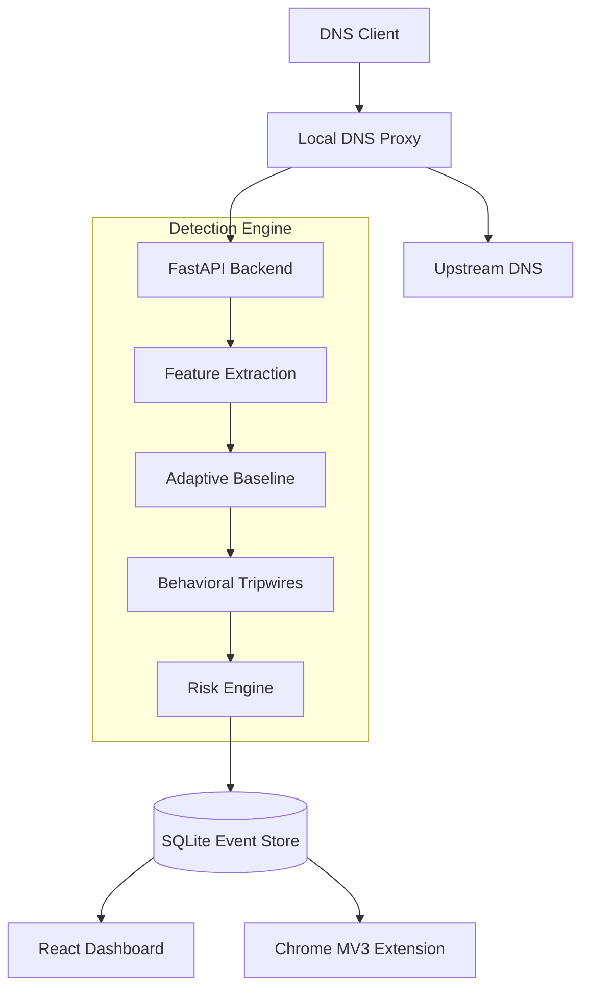

# DNSentinel

DNSentinel is a defensive cybersecurity application that detects potentially suspicious DNS behavior associated with DNS tunneling or data exfiltration.

## Project Overview

The system analyzes DNS activity using explainable statistical and rule-based signals such as query length, Shannon entropy, domain frequency, and adaptive behavioral baselines.

**IMPORTANT:** This is a defensive security project. It does NOT implement real data theft, malware, or offensive tooling. It uses synthetic suspicious patterns for demonstration purposes.

## Architecture



## Setup Instructions (Windows)

1. **Prerequisites**: Python 3.10+ and Node.js 18+ must be installed.
2. Run the setup script:
   ```cmd
   scripts\setup_windows.bat
   ```
3. Start the backend services (API + DNS Monitor):
   ```cmd
   scripts\start_backend.bat
   ```
4. Start the frontend dashboard:
   ```cmd
   scripts\start_frontend.bat
   ```
5. Open http://localhost:5173 to view the dashboard.

### Chrome Extension Setup

1. Open Chrome and navigate to `chrome://extensions/`
2. Enable **Developer mode** in the top right.
3. Click **Load unpacked** and select the `extension` folder inside this project.

## How it Works

- **DNS Monitor**: A local UDP proxy listening on port 5353 (default). It intercepts queries, forwards them to `8.8.8.8`, and sends metadata to the analysis API.
- **Detection Engine**: Calculates Shannon entropy, subdomain counts, and tracks baseline frequency over time.
- **Tripwires**: Rules that trigger when statistical thresholds are exceeded.
- **Risk Score**: Normalized 0-100 score based on features and tripwires. 60+ is considered potentially suspicious.

## Demo Mode

To see the system in action:
1. Open the React dashboard.
2. Click **Start Demo** in the sidebar.
3. The system will simulate normal traffic, followed by increasingly suspicious synthetic DNS queries.
4. Watch the dashboard metrics update and alerts trigger.
5. If you have the Chrome extension installed, visiting the flagged domains will show a warning.

## Limitations

- The Chrome extension is not a raw packet sniffer. It relies on the local API for risk classification.
- DNS visibility depends on the local environment. Encrypted DNS mechanisms such as DoH may bypass the local monitor.
- Statistical detection can generate false positives and false negatives. A high risk score is not definitive proof of compromise.
- Synthetic datasets do not perfectly represent real enterprise traffic.

## File Structure

- `/backend`: Python FastAPI application, Detection Engine, and SQLite configuration.
- `/frontend`: React + Vite dashboard application.
- `/extension`: Chrome Manifest V3 extension.
- `/datasets`: Contains synthetic datasets for CSV evaluation.
- `/scripts`: Windows batch scripts for easy setup and starting.

## License

MIT License (Hackathon Prototype).
